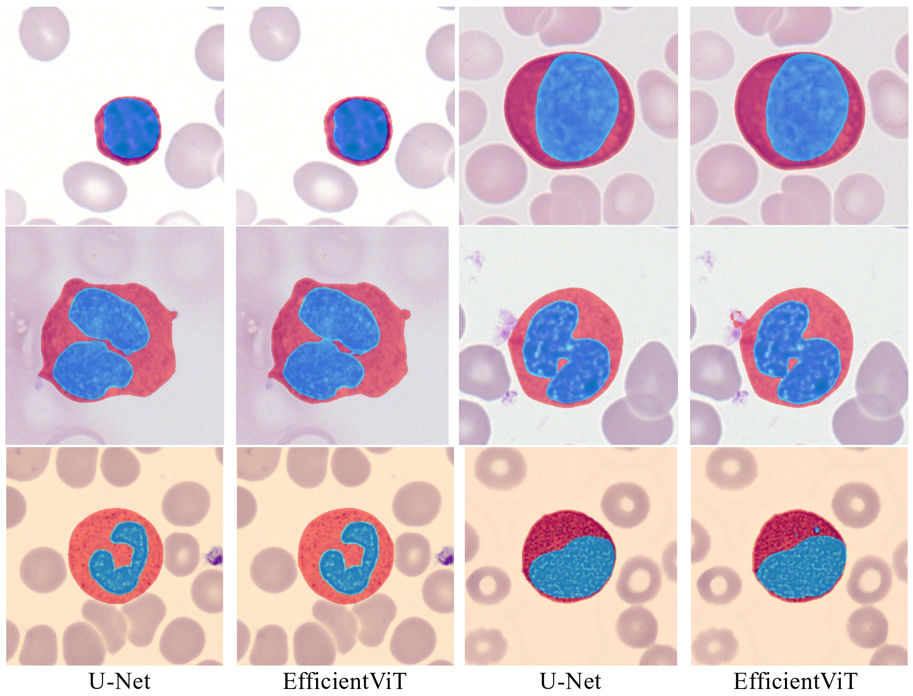

# UHNSeg-Quiz
U-Net and Vision Transformer for automatic blood cell segmentation


## Installation

This repository is built on [nnUNet](https://github.com/MIC-DKFZ/nnUNet). The installation contains two simple steps

- Install latest [pytorch](https://pytorch.org/get-started/locally/)
- `git clone https://github.com/JunMa11/UHNSeg-Quiz`
- Enter the folder `UHNSeg-Quiz` and run `pip install -e .`


## Data preparation and preprocessing

Please organize the images and masks as follows:
```bash

data/nnUNet_raw/
├── Dataset705_SingleBloodCell
	├── imagesTr
		├── img_000_0000.png
		├── img_001_0000.png
		├── ...
	├── labelsTr
		├── img_000.png
		├── img_001.png
		├── ...
	├── imagesTs-Internal
		├── Internal_img_000_0000.png
		├── Internal_img_001_0000.png
		├── ...
	├── imagesTs-External

		├── External_img_000_0000.png
		├── External_img_001_0000.png
		├── ...
	├── dataset.json 
```

Set the path

Run

```
nnUNetv2_plan_and_preprocess -d 705
```


## Model training

- To train the 2D U-Net model, run:

```bash
nnUNetv2_train 705 2d all
```

- To train the 2D Efficient ViT model, run:

```bash
nnUNetv2_train 705 2d all -tr nnUNetTrainerEffViTl1Seg
```


## Model Inference

Download the [model checkpoints](https://drive.google.com/file/d/1yeql5mCL3EwwxgDsKUIelsAKbpmUrpZK/view?usp=drive_link) to `data/nnUNet_results/Dataset705_SingleBloodCell`

- Inference the testing images with 2D U-Net model, run:

```bash
# internal validation
nnUNetv2_predict -i data/nnUNet_raw/Dataset705_SingleBloodCell/imagesTs-Internal -o data/nnUNet_raw/Dataset705_SingleBloodCell/UNet-seg-imagesTs-Internal -d 705 -c 2d -f all 

# External validation
nnUNetv2_predict -i data/nnUNet_raw/Dataset705_SingleBloodCell/imagesTs-External -o data/nnUNet_raw/Dataset705_SingleBloodCell/UNet-seg-imagesTs-External -d 705 -c 2d -f all -tr nnUNetTrainerEffViTl1Seg
```

- To train the 2D Efficient ViT model, run:

```bash
# internal validation
nnUNetv2_predict -i data/nnUNet_raw/Dataset705_SingleBloodCell/imagesTs-Internal -o data/nnUNet_raw/Dataset705_SingleBloodCell/ViT-seg-imagesTs-Internal -d 705 -c 2d -f all 

# External validation
nnUNetv2_predict -i data/nnUNet_raw/Dataset705_SingleBloodCell/imagesTs-External -o data/nnUNet_raw/Dataset705_SingleBloodCell/ViT-seg-imagesTs-External -d 705 -c 2d -f all -tr nnUNetTrainerEffViTl1Seg
```


Visualized segmentation results




## Acknowledgements

The implementation is built on [nnUNet](https://github.com/MIC-DKFZ/nnUNet) and [EfficientViT](https://github.com/mit-han-lab/efficientvit). Thanks for making the source code publicly available.